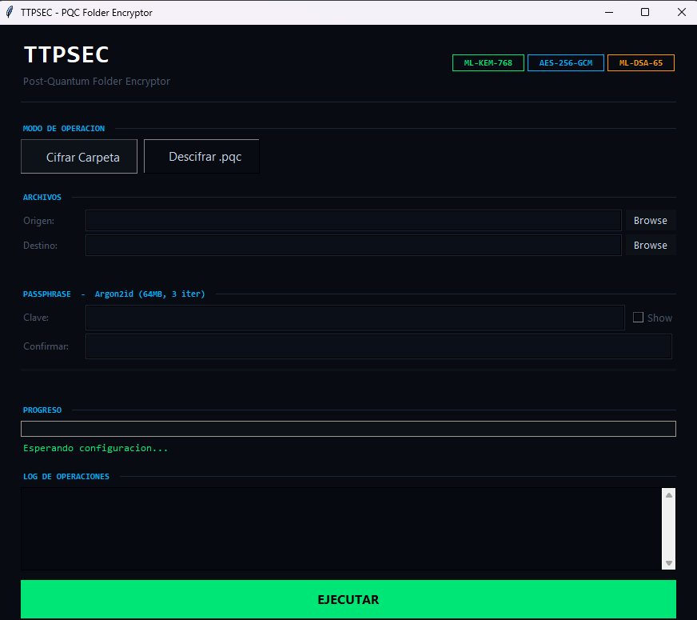

<p align="center">
  
</p>

<p align="center">
  <a href="LICENSE"></a>
  
  
  
  
  
  
</p>

# PQC Folder Encryptor v3.0

Post-quantum cryptography folder encryption tool. Encrypts entire directories into a single `.pqc` file using NIST-standardized post-quantum algorithms.
https://www.researchgate.net/publication/401719210_Democratizing_Post-Quantum_Cryptography_Design_and_Architecture_of_a_FIPS_203204-Compliant_Folder_Encryption_Tool_for_Non-Technical_Users
March 2026
DOI: 10.13140/RG.2.2.30529.01123
LicenseCC BY 4.0

> **Paper:** [Democratizing Post-Quantum Cryptography: Design and Architecture of a FIPS 203/204-Compliant Folder Encryption Tool for Non-Technical Users](https://www.researchgate.net/publication/401719210_Democratizing_Post-Quantum_Cryptography_Design_and_Architecture_of_a_FIPS_203204-Compliant_Folder_Encryption_Tool_for_Non-Technical_Users) — March 2026, DOI: 10.13140/RG.2.2.30529.01123, License: CC BY 4.0

Built by [TTPSEC SpA](https://ttpsec.cl) — OT/ICS Cybersecurity.

## Algorithms

| Layer | Algorithm | Standard |
|-------|-----------|----------|
| Key Encapsulation | **ML-KEM-768** | FIPS 203 |
| Digital Signature | **ML-DSA-65** | FIPS 204 |
| Symmetric Encryption | **AES-256-GCM** | FIPS 197 / SP 800-38D |
| Password KDF | **Argon2id** (64 MB, 3 iter) | RFC 9106 |
| Key Derivation | **HKDF-SHA256** | RFC 5869 |

## What's New in v3.0

- **Hardened container format** — New v3 binary format with `\x89PQC` magic, big-endian encoding, and length-prefixed fields
- **Full signature coverage** — ML-DSA-65 signature now covers ALL authenticated bytes (header, parameters, ciphertext, public keys, metadata, payload)
- **Crypto-agility** — Suite registry system allows future algorithm upgrades without breaking the parser
- **Fail-closed decryption** — 15-step validation chain; no files written to disk until every check passes
- **Path traversal protection** — NFC normalization, `..` rejection, Windows reserved name blocking, resolve-within-target enforcement
- **Signer identity model** — 4 verification modes: integrity-only, fingerprint, public key file, trust store
- **Domain-separated key derivation** — Unique HKDF labels per derivation purpose prevent key confusion attacks
- **Modular architecture** — Clean separation into 8 focused Python modules
- **No runtime auto-install** — Dependencies managed via `pyproject.toml`; `check_env.py` for environment verification

## Screenshot

<p align="center">
  
</p>

## Features

- Modular Python package with clean separation of concerns
- GUI (tkinter) and CLI modes
- Encrypts full directory trees preserving structure
- Per-file SHA-256 integrity verification on decrypt
- Canonical JSON manifest with deterministic ordering
- Signer identity verification (`--verify-key`, `--verify-fp`, `--trust-store`)
- Container metadata inspection (`info` subcommand)
- Password strength indicator (GUI)
- Standalone `.exe` build for Windows (no Python required)

## Quick Start

### From Source

```bash
# Install dependencies
pip install -r requirements.txt

# Verify environment
python check_env.py

# GUI mode
python -m pqc_folder_encryptor.gui

# CLI - Encrypt a folder
python -m pqc_folder_encryptor encrypt my_folder/ output.pqc -p "my-passphrase"

# CLI - Decrypt a .pqc file
python -m pqc_folder_encryptor decrypt output.pqc restored/ -p "my-passphrase"

# CLI - Inspect container metadata (no decryption)
python -m pqc_folder_encryptor info output.pqc

# CLI - Decrypt with signer identity verification
python -m pqc_folder_encryptor decrypt output.pqc restored/ --verify-key signer.pub

# Export signing public key after encryption
python -m pqc_folder_encryptor encrypt my_folder/ output.pqc --export-key signer.pub
```

### Legacy Single-File Mode

The original `pqc_encryptor.py` is preserved for backward compatibility:

```bash
python pqc_encryptor.py encrypt my_folder/ output.pqc -p "my-passphrase"
```

> **Note:** Legacy mode uses the v2 format. Use the new `pqc_folder_encryptor` package for v3 format with full security hardening.

### Standalone .exe (Windows)

```bash
# Build the executable
build_exe.bat

# The .exe is in dist/PQC-Encryptor.exe
# Distribute it — no Python installation needed
```

## Requirements

- Python 3.10+
- Dependencies (install before use — **not auto-installed**):
  - `pqcrypto` — Post-quantum cryptographic primitives (ML-KEM-768, ML-DSA-65)
  - `cryptography` — AES-256-GCM and HKDF-SHA256
  - `argon2-cffi` — Argon2id password hashing

```bash
pip install -r requirements.txt
python check_env.py  # Verify everything is correctly installed
```

> **Why no auto-install?** Runtime `pip install` is a supply chain risk. See `check_env.py` for a detailed explanation covering dependency confusion, typosquatting, and reproducibility concerns.

## How It Works

<p align="center">
  
</p>

### Encryption

```
Input folder
    |
    v
[Collect files + validate paths (NFC, no traversal)]
    |
    v
[Generate canonical manifest (sorted, SHA-256 per file)]
    |
    v
[Generate ML-KEM-768 keypair] --> [Encapsulate shared secret]
    |                                       |
    v                                       v
[Argon2id(passphrase)] --> [AES-GCM encrypt KEM secret key]
                                            |
                                            v
                 [HKDF-SHA256(shared secret, domain label)] --> encryption key
                                            |
                                            v
                           [Pack manifest + files --> AES-256-GCM encrypt payload]
                                            |
                                            v
                           [Build authenticated region (all header + payload bytes)]
                                            |
                                            v
                           [ML-DSA-65 sign ENTIRE authenticated region]
                                            |
                                            v
                                      output.pqc (v3)
```

### Decryption (fail-closed, 15-step validation)

```
input.pqc
    |
    v
[ 1. Validate magic bytes (\x89PQC)]
[ 2. Check format version (must be 3)]
[ 3. Verify suite ID (must be registered)]
[ 4. Validate field lengths and consistency]
[ 5. Detect truncation]
[ 6. Check signing key fingerprint]
    |
    v
[ 7. Verify signer identity (if configured)]
[ 8. ML-DSA-65 verify signature over ALL authenticated bytes] --> abort if invalid
    |
    v
[ 9. Argon2id(passphrase) --> Decrypt KEM secret key] --> abort if wrong passphrase
[10. ML-KEM-768 decapsulate --> shared secret]
[11. HKDF-SHA256(domain label) --> AES key --> AES-256-GCM decrypt] --> abort if tampered
    |
    v
[12. Parse and validate canonical manifest]
[13. Verify SHA-256 hash + size for every file]
[14. Validate all paths (no traversal, no escape)]
[15. Confirm resolved paths stay within output directory]
    |
    v
[ALL checks passed --> write files to disk]
    |
    v
Restored folder
```

## .pqc File Format (v3)

All multi-byte integers are **big-endian**. The ML-DSA-65 signature covers all bytes from offset 0 through the end of the encrypted payload.

| Section | Field | Size | Content |
|---------|-------|------|---------|
| **Header** | magic | 4 | `\x89PQC` (non-ASCII prefix detects text corruption) |
| | format_version | 2 | Format version, uint16 BE (currently `3`) |
| | suite_id | 2 | Cryptographic suite identifier, uint16 BE (`0x0001`) |
| **KDF Params** | argon2_salt | 16 | Argon2id salt |
| | argon2_memory | 4 | Memory cost in KiB, uint32 BE |
| | argon2_time | 4 | Time cost (iterations), uint32 BE |
| | argon2_parallel | 4 | Parallelism, uint32 BE |
| **KEM Data** | kem_ct_len | 4 | KEM ciphertext length, uint32 BE |
| | kem_ciphertext | var | ML-KEM-768 ciphertext (1088 bytes) |
| **Encrypted SK** | sk_nonce | 12 | AES-GCM nonce for SK encryption |
| | esk_len | 4 | Encrypted secret key length, uint32 BE |
| | encrypted_sk | var | AES-GCM encrypted KEM secret key (2416 bytes) |
| **Public Keys** | kem_pk_len | 4 | KEM public key length, uint32 BE |
| | kem_public_key | var | ML-KEM-768 public key (1184 bytes) |
| | sig_pk_len | 4 | Signing public key length, uint32 BE |
| | sig_public_key | var | ML-DSA-65 public key (1952 bytes) |
| **Metadata** | sig_pk_fingerprint | 32 | SHA-256 of signing public key |
| | folder_name_len | 4 | Folder name length, uint32 BE |
| | folder_name | var | Original folder name (UTF-8) |
| **Payload** | data_nonce | 12 | AES-GCM nonce for payload encryption |
| | payload_len | 8 | Encrypted payload length, uint64 BE |
| | encrypted_payload | var | AES-256-GCM encrypted (manifest + file data) |
| | | | *--- end of authenticated region ---* |
| **Signature** | sig_len | 4 | Signature length, uint32 BE |
| | signature | var | ML-DSA-65 signature (~3309 bytes) |

### Cryptographic Suite Registry

| Suite ID | KEM | Signature | AEAD | KDF | Password KDF |
|----------|-----|-----------|------|-----|-------------|
| `0x0001` | ML-KEM-768 | ML-DSA-65 | AES-256-GCM | HKDF-SHA256 | Argon2id |
| `0x0002` | *Reserved* | ML-DSA-87 | AES-256-GCM | HKDF-SHA512 | Argon2id |
| `0x0003` | *Reserved* | ML-DSA-65 | ChaCha20-Poly1305 | HKDF-SHA256 | Argon2id |

### HKDF Domain Separation Labels

| Derivation | Label |
|-----------|-------|
| Encryption key | `pqc-folder-encryptor.v1.encryption-key` |
| Manifest binding | `pqc-folder-encryptor.v1.manifest-binding` |

## Security Model

### Threat Mitigation

| Attack | Mitigated | Mechanism |
|--------|-----------|-----------|
| Ciphertext tampering | Yes | AES-256-GCM auth tag + ML-DSA-65 signature |
| Header tampering | Yes | Signature covers all bytes from magic through payload |
| Algorithm downgrade | Yes | suite_id inside signed region |
| Ciphertext swapping | Yes | Nonce + ciphertext + headers signed as a unit |
| Path traversal | Yes | NFC normalization, `..` rejection, resolve-within-target |
| Key confusion | Yes | HKDF domain separation labels |
| Truncation | Yes | Exact-length reads; trailing data rejected |
| Supply chain | Yes | No runtime pip install; pinned dependencies |
| Identity spoofing | Partial | Fingerprint + optional identity verification |

### Signer Identity Modes

| Mode | Description | CLI Flag |
|------|-------------|----------|
| Integrity only | Self-consistency check (default) | *(none)* |
| Fingerprint | Verify against known SHA-256 of signing key | `--verify-fp HEX` |
| Public key file | Verify against a key file | `--verify-key PATH` |
| Trust store | Verify against directory of `.pub` files | `--trust-store DIR` |

## Verify Downloads

Every release includes a `SHA256SUMS.txt` file. Verify the `.exe` integrity:

```powershell
# PowerShell
certutil -hashfile PQC-Encryptor.exe SHA256
```

```bash
# Linux / Git Bash
sha256sum -c SHA256SUMS.txt
```

Compare the output hash with the value in `SHA256SUMS.txt`.

## Testing

```bash
# Run round-trip tests (encrypt, decrypt, verify, tamper detection)
python tests/test_roundtrip.py

# Run regression / known-answer tests
python tests/test_vectors.py

# Verify environment
python check_env.py
```

## Project Structure

```
pqc-folder-encryptor/
├── pqc_folder_encryptor/             # Main package (v3)
│   ├── __init__.py                   # Public API: encrypt_folder(), decrypt_folder()
│   ├── __main__.py                   # python -m entry point
│   ├── config.py                     # Suite registry, constants, domain separation labels
│   ├── exceptions.py                 # Typed exception hierarchy (15 exception types)
│   ├── crypto.py                     # ML-KEM-768, ML-DSA-65, AES-256-GCM, HKDF, Argon2id
│   ├── manifest.py                   # Canonical JSON manifest, path safety validation
│   ├── container.py                  # Binary format v3 serialization and parsing
│   ├── signing.py                    # Signature operations + signer identity model
│   ├── validation.py                 # 15-step fail-closed decrypt validation chain
│   ├── cli.py                        # CLI: encrypt, decrypt, info subcommands
│   └── gui.py                        # Tkinter GUI
├── pqc_encryptor.py                  # Legacy single-file application (v2 format)
├── pyproject.toml                    # Project metadata and dependency specification
├── requirements.txt                  # Python dependencies (pinned ranges)
├── requirements-dev.txt              # Build dependencies (PyInstaller)
├── check_env.py                      # Environment verification script
├── build_exe.bat                     # Windows .exe builder script
├── tests/
│   ├── test_roundtrip.py             # Encrypt/decrypt round-trip + tamper detection
│   └── test_vectors.py               # KDF, manifest, format, path safety regression tests
├── .github/
│   ├── workflows/
│   │   ├── ci.yml                    # CI: test on push/PR
│   │   └── release.yml               # Build .exe + checksums on tag
│   ├── ISSUE_TEMPLATE/
│   │   ├── bug_report.yml            # Bug report template
│   │   └── feature_request.yml       # Feature request template
│   └── PULL_REQUEST_TEMPLATE.md      # PR template
├── LICENSE                           # MIT License
├── README.md                         # This file
├── CHANGELOG.md                      # Version history
├── SECURITY.md                       # Security policy and crypto details
├── CODE_OF_CONDUCT.md                # Contributor Code of Conduct
└── CONTRIBUTING.md                   # Contribution guidelines
```

## License

MIT License — see [LICENSE](LICENSE) for details.

Copyright (c) 2026 TTPSEC SpA
